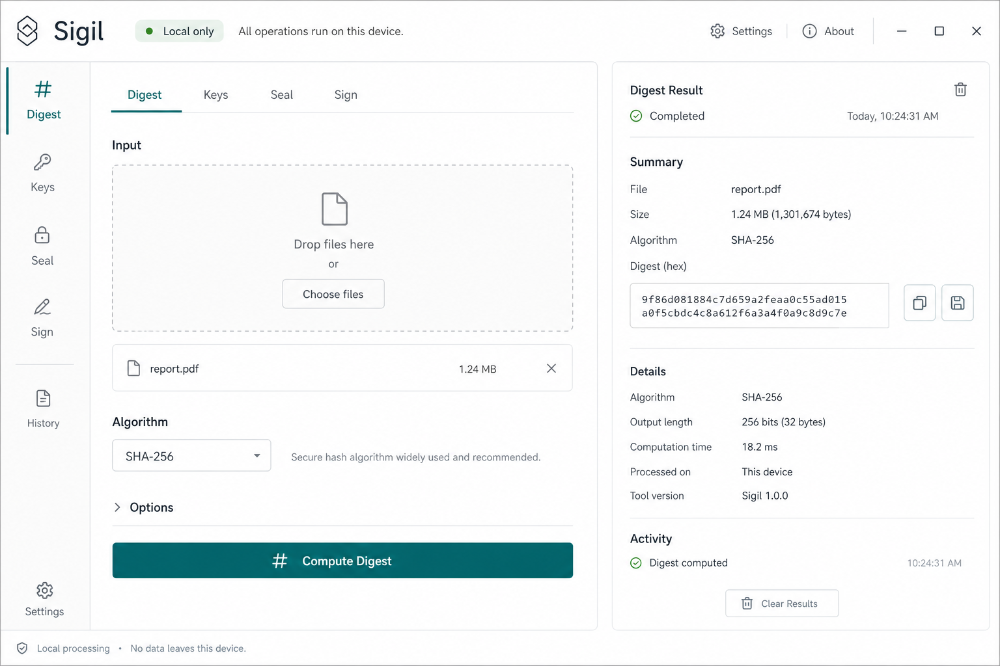

# Sigil

Sigil is a clean, local-first cryptography and cryptology engineering suite.
It ships as a fast Go CLI with an embedded minimalist graphical workspace.



## Current Utilities

- Digest: SHA-256, SHA-384, SHA-512, SHA3-256, SHA3-384, SHA3-512, plus legacy MD5/SHA-1 marked as deprecated.
- HMAC: keyed tags over non-deprecated SHA-2 and SHA-3 hashes.
- Entropy: byte frequency, Shannon entropy, chi-square, printable/null ratios, and top byte distribution.
- Random: CSPRNG bytes and passphrases from `crypto/rand`.
- XOR: fixed-length and repeating-key XOR transforms for analysis work.
- Keys: Ed25519 key generation in standard PEM encodings.
- Sign/verify: Ed25519 message signatures.
- Seal/open: chunked AES-256-GCM authenticated envelopes with PBKDF2-HMAC-SHA256 passphrase derivation.

## Run

```bash
go run ./cmd/sigil gui
```

The GUI binds to `127.0.0.1:8765` by default and prints the local URL.

CLI examples:

```bash
go run ./cmd/sigil digest -alg sha3-256 ./README.md
go run ./cmd/sigil random -bytes 32 -out hex
go run ./cmd/sigil keygen
SIGIL_PASSPHRASE='use-a-real-passphrase-here' go run ./cmd/sigil seal -out secret.sigil ./plain.txt
SIGIL_PASSPHRASE='use-a-real-passphrase-here' go run ./cmd/sigil open -out plain.txt secret.sigil
```

## Security Posture

Sigil does not implement new cryptographic primitives. The first slice uses
Go standard-library cryptography and keeps the browser environment local,
token-guarded, CSP-restricted, and dependency-free.

This project is not externally audited yet. Treat it as an engineering-grade
foundation, not as a certified product or a FIPS-validated module.

See [docs/SECURITY_MODEL.md](docs/SECURITY_MODEL.md) for details.

## Verify

```bash
GOCACHE="$PWD/.cache/go-build" go test ./...
```

The test suite covers digest vectors, HMAC policy, XOR utilities, Ed25519
round trips, AES-GCM seal/open round trips, tamper rejection, entropy reporting,
and GUI token/CSP guards.
