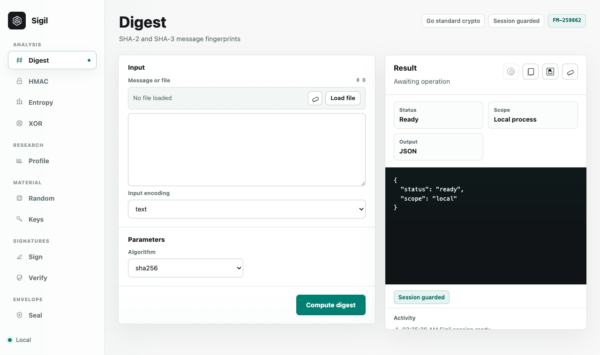

# Sigil

Sigil is a local-first cryptography and cryptology workbench written in Go. It
ships as a CLI plus an embedded browser GUI for everyday hashing, MACs,
random material, entropy inspection, XOR transforms, Ed25519 signatures, and
AES-256-GCM passphrase-sealed envelopes. It also includes a cryptanalytic
sample profile for unknown blobs, protocol artifacts, and research corpora.

Sigil is intentionally conservative: it uses Go standard-library cryptography,
does not introduce new primitives, and keeps GUI processing inside the local
Sigil process.



## Quick Start

Run the local GUI:

```bash
go run ./cmd/sigil gui
```

By default the GUI listens on `127.0.0.1:8765` and prints the local URL. To use
a different local address:

```bash
go run ./cmd/sigil gui -addr 127.0.0.1:8777
```

Run CLI commands directly:

```bash
go run ./cmd/sigil digest -alg sha3-256 ./README.md
go run ./cmd/sigil random -bytes 32 -out hex
go run ./cmd/sigil entropy -encoding text "sample text"
```

Install the command into your Go bin path:

```bash
go install ./cmd/sigil
sigil version
```

Sigil currently targets the Go version declared in [go.mod](go.mod).

## Command Surface

| Command | Purpose |
| --- | --- |
| `sigil gui` | Start the local browser workspace. |
| `sigil version` | Print the Sigil version. |
| `sigil algorithms` | Print supported hash, signature, and envelope algorithms as JSON. |
| `sigil digest` | Hash a file or stdin with SHA-2, SHA-3, or deprecated legacy digests. |
| `sigil hmac` | Compute HMAC tags with non-deprecated SHA-2 and SHA-3 hashes. |
| `sigil random` | Generate CSPRNG bytes or passphrases from `crypto/rand`. |
| `sigil entropy` | Report byte frequency, Shannon entropy, chi-square, printable and null-byte ratios, and top byte distribution. |
| `sigil profile` | Produce a cryptanalytic triage report with bit balance, byte coincidence, block-repeat, autocorrelation, and repeating-key hints. |
| `sigil xor` | Run fixed-length or repeating-key XOR transforms for analysis work. |
| `sigil keygen` | Generate an Ed25519 public/private key pair in PEM encodings. |
| `sigil sign` | Sign input with an Ed25519 private key. |
| `sigil verify` | Verify an Ed25519 signature with a public key. |
| `sigil seal` | Write an authenticated AES-256-GCM envelope. |
| `sigil open` | Open a Sigil envelope after authentication succeeds. |

Most file-oriented commands accept a file path or `-` for stdin. Encoded-input
commands such as `entropy`, `sign`, and `verify` accept inline values, `@file`
references, or stdin.

## CLI Examples

Digest a file:

```bash
sigil digest -alg sha256 ./README.md
```

Compute an HMAC with a hex key:

```bash
sigil hmac -alg sha3-256 -key 00112233445566778899aabbccddeeff ./README.md
```

Generate random material:

```bash
sigil random -bytes 32 -out base64
sigil random -password 24
```

Inspect entropy:

```bash
sigil entropy -encoding hex deadbeef
sigil entropy -encoding base64 @sample.b64
```

Profile an unknown sample for research triage:

```bash
sigil profile -encoding base64 @capture.b64
sigil profile -encoding hex -max-lag 64 -max-key-size 80 @artifact.hex
```

Generate keys, sign a message, and verify it:

```bash
sigil keygen > ed25519-keypair.json
sigil sign -key private.pem "message to sign"
sigil verify -key public.pem -sig "$SIGIL_SIGNATURE" "message to sign"
```

`keygen` prints JSON with `privatePem`, `publicPem`, and `publicKeyBase64`
fields. Write the PEM values to `private.pem` and `public.pem` before using the
CLI signing commands.

Seal and open a file with a passphrase supplied through the environment:

```bash
SIGIL_PASSPHRASE='use-a-real-passphrase-here' sigil seal -out secret.sigil ./plain.txt
SIGIL_PASSPHRASE='use-a-real-passphrase-here' sigil open -out plain.txt secret.sigil
```

For automation, prefer `SIGIL_PASSPHRASE` or `-passphrase-file` over passing a
secret directly on the command line.

## GUI

The GUI exposes the same core operations through a dependency-free embedded
web app:

- Digest, HMAC, entropy, XOR, random bytes and passwords.
- Cryptanalytic sample profiling for bit balance, byte coincidence, repeated
  blocks, autocorrelation, and repeating-key-size triage.
- Ed25519 key generation, signing, and verification.
- AES-256-GCM seal and open workflows.
- Local file loading in the browser for supported operations.
- JSON result output with copy and save actions.

GUI requests are token-guarded per process, JSON-only, same-origin checked, and
served with a strict Content Security Policy. The GUI server does not emit CORS
headers and does not write submitted secrets to disk.

## Security Posture

Sigil is an engineering-grade local tool, not an externally audited or
FIPS-validated product.

Current cryptographic choices:

- Hashes: SHA-256, SHA-384, SHA-512, SHA3-256, SHA3-384, SHA3-512, plus MD5
  and SHA-1 marked as deprecated for digest-only legacy inspection.
- HMAC: SHA-2 and SHA-3 only; deprecated digests are rejected.
- Randomness: `crypto/rand`.
- Signatures: Ed25519 with PKIX public keys and PKCS#8 private keys.
- Sealing: chunked AES-256-GCM records.
- KDF: PBKDF2-HMAC-SHA256, default 600,000 iterations, minimum 100,000.
- Tamper behavior: authentication failure aborts opening.

See [docs/SECURITY_MODEL.md](docs/SECURITY_MODEL.md) for boundaries,
assumptions, and near-term hardening work.

## Development

Run tests with a repo-local Go build cache:

```bash
GOCACHE="$PWD/.cache/go-build" go test ./...
```

The current suite covers digest vectors, HMAC policy, XOR utilities, Ed25519
round trips, AES-GCM seal/open round trips, tamper rejection, entropy reporting,
cryptanalytic profile metrics, and GUI token/CSP guards.

Useful paths:

- [cmd/sigil/main.go](cmd/sigil/main.go): CLI entrypoint and command parsing.
- [internal/crypto](internal/crypto): cryptographic operations and encoding helpers.
- [internal/gui](internal/gui): local GUI server and static browser app.
- [docs/SECURITY_MODEL.md](docs/SECURITY_MODEL.md): security model and project boundaries.
